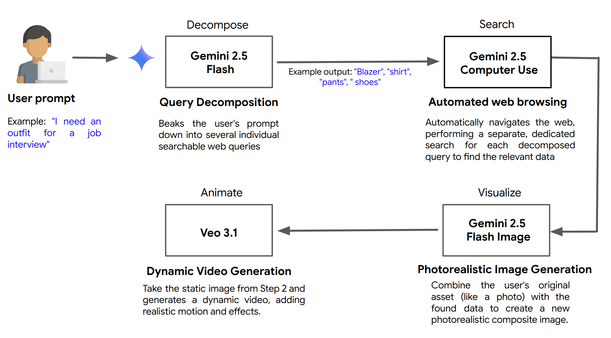

# 🤖 AI Shopping Assistant

An end-to-end AI-powered shopping experience combining Google Gemini 2.5 Computer Use, Gemini 2.5 Flash Image (Nano Banana), and Veo 3.1.

**Author:** [Wafae Bakkali](https://www.linkedin.com/in/wafae-bakkali/)


### Disclaimer

**This is not an officially supported Google product.**

This project is a technical proof-of-concept for educational purposes. The workflow shown in the demo is intended to illustrate the capabilities of these AI models. The use of a commercial website and its content is for demonstration purposes only.

A real-world application of this technology would require explicit permission from website owners to ensure it aligns with their policies and content usage guidelines.

---

# AI Shopping Agent with Gemini, Nano Banana, and Veo

This repository contains the code for the blog post: **[Link to your blog post here]**

This project demonstrates an end-to-end generative AI workflow that combines:

* **Gemini 2.5 Computer Use:** To act as an agent, understanding a prompt and navigating a web UI to collect product data.
* **Gemini 2.5 Flash Image (Nano Banana):** To generate a photorealistic Virtual Try-On (VTO) image.
* **Veo 3.1:** To animate the static VTO image into a dynamic 360° video.

## 🚀 Workflow Overview

!

[Image of the workflow diagram from your blog post]
(path/to/your/image.png)

1.  **Decompose & Search (Gemini 2.5 Computer Use):** The agent takes a natural language prompt (e.g., "outfit for a job interview"), breaks it down, and navigates a website to find matching items.
2.  **Visualize (Nano Banana):** The user selects their favorite items, and the model generates a new image of them wearing the complete outfit.
3.  **Animate (Veo 3.1):** The model takes the static VTO image and turns it into a short, 8-second video with realistic camera motion.

## 🛠️ Setup and Installation

1.  **Clone the repository:**
    ```sh
    git clone [https://github.com/your-username/your-repo-name.git](https://github.com/your-username/your-repo-name.git)
    cd your-repo-name
    ```

2.  **Install dependencies:**
    *(You must create this `requirements.txt` file by running `pip freeze > requirements.txt` in your environment)*
    ```sh
    pip install -r requirements.txt
    ```

3.  **Add API Keys:**
    This project requires API access to Google's Generative AI models. Create a `.env` file in the root directory and add your key:
    ```
    GOOGLE_API_KEY="your_api_key_here"
    ```

## ⚡ How to Run

*(This is an example; you should replace it with your actual commands)*

**1. Run the Browsing Agent:**

```sh
python run_agent.py --prompt "I need a blazer and shirt for a party"
## 🏗️ Overview



The system uses a four-stage pipeline:
1. **Decompose**: Gemini 2.5 Flash breaks down natural language queries into searchable items
2. **Search**: Gemini 2.5 Computer Use automatically browses the web to find products
3. **Visualize**: Gemini 2.5 Flash Image creates photorealistic try-on images
4. **Animate**: Veo 3.1 generates dynamic product showcase videos

## 🛠️ Tech Stack

- **Frontend**: React, Tailwind CSS
- **Backend**: Flask, Python
- **AI Models**: 
  - Gemini 2.5 Computer Use
  - Gemini 2.5 Flash Image (Nano Banana)
  - Veo 3.1
- **Automation**: Playwright
- **Image Processing**: Pillow

---

## 📋 Prerequisites

### System Requirements

- **Python**: 3.11 or 3.12
- **Node.js**: 18+
- **RAM**: 4GB minimum
- **OS**: Linux (Ubuntu 20.04+) or macOS

### Required API Keys

1. **Gemini API Key**: Get from https://aistudio.google.com/app/apikey
2. **Google Cloud Project** (optional, for Veo video generation)

---

## 🚀 Installation

### Step 1: Install System Dependencies

```bash
./install_system_deps.sh
```

**⚠️ Important**: This installs required libraries including `libevent-2.1-7t64` which is needed for Playwright.

### Step 2: Clone Repository

```bash
git clone https://github.com/WafaeBakkali/ai-shopping-agent.git
cd ai-shopping-assistant
```

### Step 3: Backend Setup

```bash
cd backend

# Create virtual environment
python3 -m venv venv

# Activate virtual environment
source venv/bin/activate

# Upgrade pip
pip install --upgrade pip

# Install dependencies
pip install -r requirements.txt

# Install Playwright browsers
playwright install
```

### Step 4: Frontend Setup

```bash
cd ../frontend
npm install
```

### Step 5: Set Environment Variables

```bash
# Required
export GEMINI_API_KEY='your-gemini-api-key-here'

# Optional (for Veo video generation)
export GOOGLE_CLOUD_PROJECT='your-gcp-project-id'

# Optional (for Veo authentication)
gcloud auth application-default login
```

**💡 Tip**: Add to `~/.bashrc` to persist:
```bash
echo 'export GEMINI_API_KEY="your-key"' >> ~/.bashrc
source ~/.bashrc
```

---

## 🎮 Running the Application

### Terminal 1: Backend
```bash
cd backend
source venv/bin/activate
python app.py
```

Expected output:
```
✅ GEMINI_API_KEY: Set
✅ GOOGLE_CLOUD_PROJECT: your-project
🚀 Starting Flask server on http://localhost:5000
```

### Terminal 2: Frontend
```bash
cd frontend
npm start
```

Opens at: **http://localhost:3000**

---

## 📁 Project Structure

```
ai-shopping-assistant/
├── backend/
│   ├── app.py                    # Flask server
│   ├── computer_use_helper.py    # Computer Use automation
│   ├── vto_generator.py          # Virtual try-on
│   ├── video_generator.py        # Veo video generation
│   └── requirements.txt          # Python dependencies
├── frontend/
│   ├── src/
│   │   └── App.js               # React app
│   └── package.json
├── install_system_deps.sh        # System dependencies installer
└── README.md
```

---

## 🎯 Usage Flow

**Example: Fashion Shopping**

1. **Search**: Enter natural language query (e.g., "outfit for interview under 300 euros")
2. **Select**: Choose 3-4 items from results
3. **Upload Photo**: Upload your photo
4. **Generate Try-On**: AI creates photorealistic image of you wearing the items
5. **Create Video**: Generate 360° product showcase video
6. **Purchase**: Complete the order

**Works for multiple categories:** Fashion, home decoration, electronics, and more!

---

## 🔧 Troubleshooting

### ❌ `ModuleNotFoundError: No module named 'flask'`

**Cause**: Virtual environment not activated or packages not installed

**Solution**:
```bash
cd backend
source venv/bin/activate
pip install -r requirements.txt
```

### ❌ `ImportError: cannot import name 'genai'`

**Cause**: Wrong package installed

**Solution**:
```bash
pip uninstall google
pip install google-genai
```

### ❌ Playwright Error: `libevent-2.1-7t64` missing

**Cause**: System dependency not installed

**Solution**:
```bash
sudo apt install -y libevent-2.1-7t64
playwright install
```

### ❌ `Failed building wheel for greenlet`

**Cause**: Python 3.13 is not supported

**Solution**: Use Python 3.12
```bash
sudo apt install python3.12 python3.12-venv python3.12-dev
cd backend
rm -rf venv
python3.12 -m venv venv
source venv/bin/activate
pip install -r requirements.txt
playwright install
```

### ❌ `python -m venv --without-pip venv` deletes packages

**⚠️ Never use `--without-pip`!** This recreates the venv and deletes all packages.

**Correct command**:
```bash
python3 -m venv venv
```

### ❌ Video generation fails

**Cause**: Missing Google Cloud authentication

**Solution**:
```bash
export GOOGLE_CLOUD_PROJECT='your-project-id'
gcloud auth application-default login
gcloud services enable aiplatform.googleapis.com
```

### ❌ CORS errors

**Cause**: Backend not running or wrong port

**Solution**: Verify backend is running on port 5000, then restart both servers

---

## 🐛 Report a Bug

Found a bug or issue? Please help improve this project:

1. Check if the issue already exists in [Issues](https://github.com/WafaeBakkali/ai-shopping-agent/issues)
2. If not, create a new issue with:
   - Clear description of the problem
   - Steps to reproduce
   - Expected vs actual behavior
   - Your environment (OS, Python version, etc.)
   - Error messages or screenshots

---

## 📜 License

MIT License - See LICENSE file for details

---

⭐ **If you found this project helpful, please star it on GitHub!**
